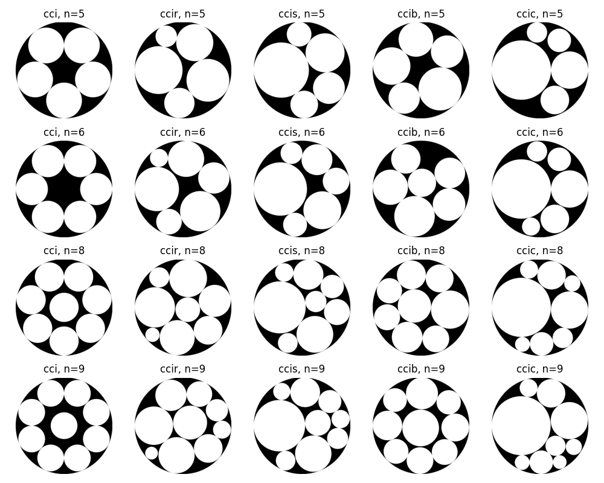
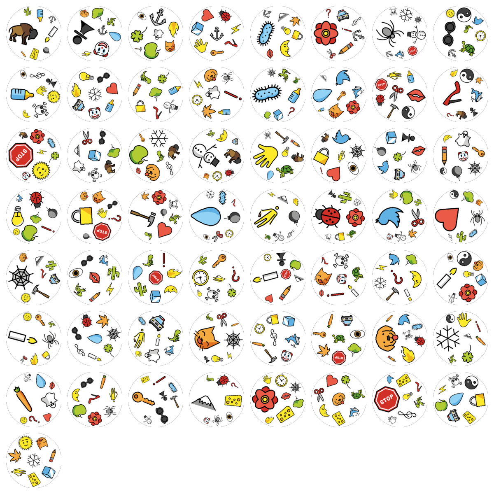
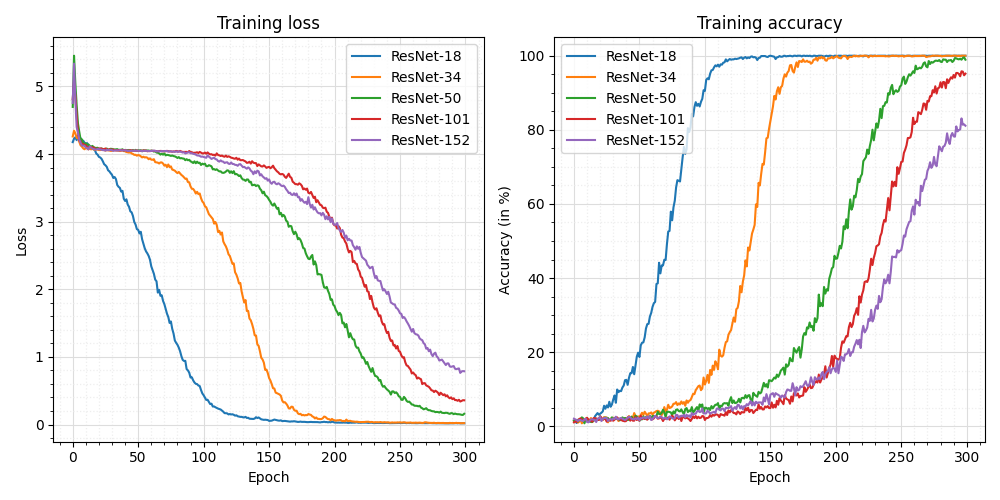

# Deep Learning with Dobble

[](https://jupyterlab.readthedocs.io/en/stable)
[](https://www.python.org)
[](https://pytorch.org)
[](https://www.gnu.org/licenses/gpl-3.0.html.en)

Welcome to **Deep Learning with Dobble**! This repository contains the results of a graded project that formed part of the **Deep Learning** seminar taught at the [**University of Giessen**](https://www.uni-giessen.de/) during the summer term 2023.

## Table of Contents

- [The Card Game *Dobble*](#the-card-game-dobble)
- [Generating *Dobble* Decks](#generating-dobble-decks)
- [A Deep Learning Pipeline](#a-deep-learning-pipeline)
- [Comparing ResNet Models](#comparing-resnet-models)
- [Getting Started](#getting-started)
- [Languages & Tools](#languages-and-tools)
- [References](#references)
- [Acknowledgments](#acknowledgments)
- [License](#license)

## The Card Game *Dobble*

[*Dobble*](https://www.dobblegame.com) is a popular card game that challenges players to spot matching symbols between pairs of cards. While there are different modes of play, the basic idea of the game remains the same: every two cards in a deck of playing cards have exactly one symbol in common, and players must identify that unique symbol as quickly as possible. A classic *Dobble* deck consists of 55 playing cards, with 8 different symbols placed on each card. The constraint that any two cards share one and only one symbol gives rise to a rich mathematical structure known as finite projective planes. There are several well-written articles on the web about this topic, some of which I have listed in the [References](#references) section of this README.

<div align="center">
    
    <p>A set of <em>Dobble</em> cards.  <a href="https://brettspiel-empfehlungen.de">&copy Brettspiel Empfehlungen</a>. Used with permission.</p>
</div>

The goal of this project when Nina (a fellow student) and I started working on it was twofold:

1. Implement an algorithm that can generate custom *Dobble* decks based on a set of open-source emojis that serve as symbols on the cards.
1. Set up a deep learning pipeline to train, validate, and test arbitrary model architectures with the goal of teaching those models to play *Dobble*.

In this README, I will walk you through the indidvidual steps we took to achieve these goals. If you're interested in running the Jupyter notebooks on your local machine, check out the [Getting Started](#getting-started) section.

## Generating *Dobble* Decks

In order to create our own *Dobble* decks, we would need to go through the following steps:

1. Find open source emojis to use as symbols on the playing cards.

1. Develop an algorithm that takes an arbitrary number of emojis and places them on a white disk on top of a transparent background to resemble a single playing card. In doing so, we need to make sure that no two emojis overlap. Ideally, the way we place the emojis on the white disk will resemble the way the symbols are arranged on actual *Dobble* playing cards.

1. Develop an algorithm that determines which emojis to place on which card to satisfy the constraint that every two playing cards have exactly one emoji in common.

The emojis used for this project are taken from [OpenMoji](https://openmoji.org) - the open-source emoji and icon project. Here are the reasons for choosing OpenMoji:

- The emojis are open source and published under the [Creative Commons Share Alike License 4.0](https://creativecommons.org/licenses/by-sa/4.0/#).

- There are over 4,000 emojis to choose from!

- All emojis follow a common [styleguide](https://openmoji.org/styleguide/#styleguide). Most importantly, all emojis use the same primary and secondary [colors](https://openmoji.org/styleguide/#color). This is crucial for resembling the original *Dobble* playing cards, as the symbols on those cards also use only a finite set of colors (i.e., a single shade of green, a single shade of yellow, and so on).

Here are the emojis we have chosen to resemble the original *Dobble* symbols as close as possible:

<div align="center">
    
    <p>The emojis from <a href="https://openmoji.org">OpenMoji</a> used to create our own deck of <em>Dobble</em> playing cards.</p>
</div>

Next, we had to implement a logic that would place the selected emojis on our virtual playing cards in such a way that ...

- the available space on each card would be utilized as much as possible,

- no two emojis would overlap,

- the arrangement of emojis on our virtual playing cards would resemble the appearance of actual *Dobble* cards.

To solve this task, we used results from the mathematical theory of *circle packing*. Circle packing involves arranging circles in a confined space so that they touch but don't overlap, aiming to fit as many circles as possible. The data we used for this project were taken from [Prof. Dr.-Ing. Eckehard Specht](https://www.ltv.ovgu.de/Mitarbeiter/Lehrstuhlinhaber/Prof_+Eckehard+Specht-p-210.html)'s website [packomania.com](http://www.packomania.com). A few selected circle packings for different numbers of circles are visualized below.

<div align="center">
    
    <p>Different types of circle packings for different numbers of circles.</p>
</div>

Although all the square images of the emojis are the same size (in pixels), the emojis within them take up different amounts of space. In addition, some emojis extend far into the corners of the images, while others do not. To account for this, we have implemented a simple algorithm that automatically resizes each emoji to take up as much space as possible without extending outside the incircle of the square image. Below you can find an emoji that extended too far into the top right-hand corner, and consequently was downsized to correct for this.

<div align="center">
    
    <p>Emojis that extend into the corners are automatically downsized.</p>
</div>

The ice emoji, on the other hand, does not use nearly all of the space available in the square image, so it is automatically enlarged.

<div align="center">
    
    <p>Emojis that are too small are automatically enlarged.</p>
</div>

Below you can see the full set of emojis, automatically resized to take up as much space as possible without extending outside the incircle of the square image.

<div align="center">
    
    <p>Resized emojijs.</p>
</div>

<div align="center">
    
    <p>The full set of playing cards used in this project.</p>
</div>

## A Deep Learning Pipeline

<div align="center">
    
    <p>Using image augmentation to increase the variability of our dataset.</p>
</div>

<div align="center">
    
    <p>The REX learning rate schedule.</p>
</div>

## Comparing ResNet Models

<div align="center">
    
    <p>Training results for ResNet models of different depths.</p>
</div>

## Getting Started

Follow these steps to clone the repository and run the project on your local machine.

### Prerequisites

- Python 3.11 or higher installed on your machine.
- Operating system: Unix/macOS

### Clone the Repository

1. Open a terminal or command prompt on your local machine.

2. Clone the repository using `git`:

```
git clone https://github.com/mrvnthss/deep-learning-with-dobble
cd deep-learning-with-dobble
```

### Set up a Virtual Environment (Optional but Recommended)

Before you begin, make sure that `pip` is installed on your system. `pip` is a package manager for Python, and it's usually included by default when you install Python. To ensure that `pip` is installed, run the following commands:

```
python3 -m pip install --user --upgrade pip
python3 -m pip --version
```

Setting up a virtual environment helps isolate project dependencies. If you don't have `virtualenv` installed, you can install it using:

```
python3 -m pip install --user virtualenv
```

Create and activate a virtual environment:

```
python3 -m venv .venv
source .venv/bin/activate
```

### Install Dependencies

All the dependencies that are required to execute the notebooks in this repository are listed in the [requirements.txt](requirements.txt) file. Installing these is a breeze. Simply issue the following command after you have set up your virtual environment:

```
python3 -m pip install -r requirements.txt
```

### Start JupyterLab

To start [JupyterLab](https://jupyter.org), simply run the following command inside your activated virtual environment:

```
juypter lab
```

That's it, you're good to go! Simply navigate to the [notebooks/](notebooks) directory and open one of the notebooks. The [deep-learning-with-dobble.ipynb](notebooks/deep-learning-with-dobble.ipynb) notebook contains most of the project, so I'd recommend exploring this one first!

## Languages and Tools

<p align="left">
  <a href="https://jupyterlab.readthedocs.io/en/latest/" target="_blank" rel="noreferrer">
    
  </a>
  &nbsp;
  <a href="https://www.python.org" target="_blank" rel="noreferrer">
    
  </a>
  &nbsp;
  <a href="https://pytorch.org/" target="_blank" rel="noreferrer">
    
  </a>
  &nbsp;
  <a href="https://numpy.org" target="_blank" rel="noreferrer">
    
  </a>
  &nbsp;
  <a href="https://opencv.org/" target="_blank" rel="noreferrer">
    
  </a>
  &nbsp;
  <a href="https://pandas.pydata.org/" target="_blank" rel="noreferrer">
    
  </a>
</p>

## References

- Collingridge, P. (2018, September 13). *Dobble*. petercollingridge.co.uk. https://www.petercollingridge.co.uk/blog/mathematics-toys-and-games/dobble/

- Dore, M. (2021, December 29). The maths behind Dobble. *Medium*. https://mickydore.medium.com/dobble-theory-and-implementation-ff21ddbb5318

- *Finite Projective Planes and the Math of Spot It!* (2023, March 29). Puzzlewocky. https://puzzlewocky.com/games/the-math-of-spot-it/

## Acknowledgments

The emojis used in this project are designed by [**OpenMoji**](https://openmoji.org/) - the open-source emoji and icon project. License: [CC BY-SA 4.0](https://creativecommons.org/licenses/by-sa/4.0/#)

The data on circle packings used in this project are made available by [**Prof. Dr.-Ing. Eckehard Specht**](https://www.ltv.ovgu.de/Mitarbeiter/Lehrstuhlinhaber/Prof_+Eckehard+Specht-p-210.html) on his website [**packomania.com**](http://www.packomania.com).

## License

This project is licensed under the [GNU General Public License v3.0](https://www.gnu.org/licenses/gpl-3.0.en.html) (GPLv3) - see the [LICENSE](LICENSE) file for details.

You are free to:

- **Share**: Copy and redistribute the material in any medium or format.
- **Adapt**: Remix, transform, and build upon the material for any purpose, even commercially.

Under the following terms:

- **Attribution**: You must give appropriate credit, provide a link to the license, and indicate if changes were made. You may do so in any reasonable manner, but not in any way that suggests the licensor endorses you or your use.
- **ShareAlike**: If you remix, transform, or build upon the material, you must distribute your contributions under the same license as the original.
- **No additional restrictions**: You may not apply legal terms or technological measures that legally restrict others from doing anything the license permits.
