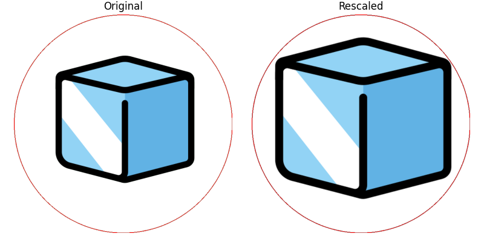

# Deep Learning with Dobble

[](https://jupyterlab.readthedocs.io/en/stable)
[](https://www.python.org)
[](https://pytorch.org)
[](https://www.gnu.org/licenses/gpl-3.0.html.en)

Welcome to **Deep Learning with Dobble**! This repository contains the results of a graded project that formed part of the **Deep Learning** seminar taught at the [**University of Giessen**](https://www.uni-giessen.de/) during the summer term 2023.

## Table of Contents

- [Overview](#overview)
- [The Card Game *Dobble*](#the-card-game-dobble)
- [Generating *Dobble* Decks](#a-dobble-algorithm)
- [A Deep Learning Pipeline](#a-deep-learning-pipeline)
- [Comparing ResNet Models](#comparing-resnet-models)
- [Getting Started](#getting-started)
- [Languages & Tools](#languages-and-tools)
- [References](#references)
- [Acknowledgments](#acknowledgments)
- [License](#license)

## Overview

## The Card Game *Dobble*

## Generating *Dobble* Decks

<div align="center">
    
    <p>The emojis used to create our own deck of <em>Dobble</em> playing cards.</p>
</div>

<div align="center">
    
    <p>Emojis that extend into the corners are automatically downsized.</p>
</div>

<div align="center">
    
    <p>Emojis that are too small are automatically enlarged.</p>
</div>

<div align="center">
    
    <p>Resized emojijs.</p>
</div>

<div align="center">
    
    <p>The full set of playing cards used in this project.</p>
</div>

## A Deep Learning Pipeline

<div align="center">
    
    <p>Using image augmentation to increase the variability of our dataset.</p>
</div>

<div align="center">
    
    <p>The REX learning rate schedule.</p>
</div>

## Comparing ResNet Models

<div align="center">
    
    <p>Training results for ResNet models of different depths.</p>
</div>

## Getting Started

Follow these steps to clone the repository and run the project on your local machine.

### Prerequisites

- Python 3.11 or higher installed on your machine.
- Operating system: Unix/macOS

### Clone the Repository

1. Open a terminal or command prompt on your local machine.

2. Clone the repository using `git`:

```
git clone https://github.com/mrvnthss/deep-learning-with-dobble
cd deep-learning-with-dobble
```

### Set up a Virtual Environment (Optional but Recommended)

Before you begin, make sure that `pip` is installed on your system. `pip` is a package manager for Python, and it's usually included by default when you install Python. To ensure that `pip` is installed, run the following commands:

```
python3 -m pip install --user --upgrade pip
python3 -m pip --version
```

Setting up a virtual environment helps isolate project dependencies. If you don't have `virtualenv` installed, you can install it using:

```
python3 -m pip install --user virtualenv
```

Create and activate a virtual environment:

```
python3 -m venv .venv
source .venv/bin/activate
```

### Install Dependencies

All the dependencies that are required to execute the notebooks in this repository are listed in the [requirements.txt](requirements.txt) file. Installing these is a breeze. Simply issue the following command after you have set up your virtual environment:

```
python3 -m pip install -r requirements.txt
```

### Start JupyterLab

To start [JupyterLab](https://jupyter.org), simply run the following command inside your activated virtual environment:

```
juypter lab
```

That's it, you're good to go! Simply navigate to the [notebooks/](notebooks) directory and open one of the notebooks. The [deep-learning-with-dobble.ipynb](notebooks/deep-learning-with-dobble.ipynb) notebook contains most of the project, so I'd recommend exploring this one first!

## Languages and Tools

<p align="left">
  <a href="https://www.python.org" target="_blank" rel="noreferrer">
    
  </a>
  &nbsp;
  <a href="https://pytorch.org/" target="_blank" rel="noreferrer">
    
  </a>
  &nbsp;
  <a href="https://numpy.org" target="_blank" rel="noreferrer">
    
  </a>
  &nbsp;
  <a href="https://opencv.org/" target="_blank" rel="noreferrer">
    
  </a>
  &nbsp;
  <a href="https://pandas.pydata.org/" target="_blank" rel="noreferrer">
    
  </a>
</p>

## References

## Acknowledgments

## License

This project is licensed under the [GNU General Public License v3.0](https://www.gnu.org/licenses/gpl-3.0.en.html) (GPLv3) - see the [LICENSE](LICENSE) file for details.

You are free to:

- **Share**: Copy and redistribute the material in any medium or format.
- **Adapt**: Remix, transform, and build upon the material for any purpose, even commercially.

Under the following terms:

- **Attribution**: You must give appropriate credit, provide a link to the license, and indicate if changes were made. You may do so in any reasonable manner, but not in any way that suggests the licensor endorses you or your use.
- **ShareAlike**: If you remix, transform, or build upon the material, you must distribute your contributions under the same license as the original.
- **No additional restrictions**: You may not apply legal terms or technological measures that legally restrict others from doing anything the license permits.
